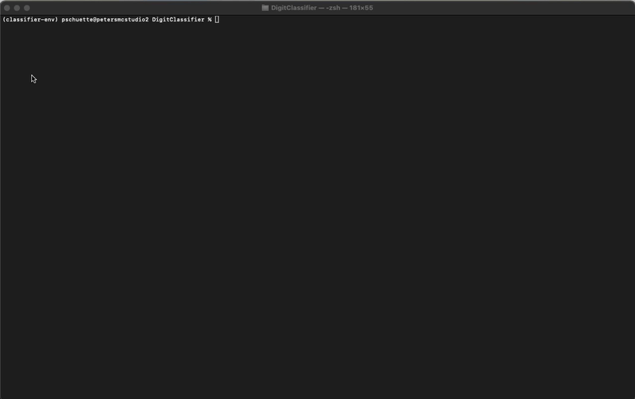

# DigitClassifier
Use font files to augment the MNIST Dataset and to train a classifier better suited for printed fonts. This is meant to improve the accuracy of the [SudokuSolver](https://github.com/pschuette22/SudokuSolver) decoding task.


## Setup
### Install Fonts
Download a variety of fonts (the more the better!) from [Google Fonts](https://fonts.google.com/) or from the [Google Fonts Github Project](https://github.com/google/fonts) and add them to the `fonts/` folder.

Additionally, installing fonts using [fnt](https://github.com/alexmyczko/fnt) will add more training data.

### Create environment
Download and install [miniconda](https://docs.anaconda.com/miniconda/).

Setup the environment. Due to framework conflicts, I recommend using these provided `requirements.txt` and python 3.11.

Create the conda environment, activate, install the requirements, and start the notebook.

```bash
conda create -n classifier-env python=3.11 pip
conda activate classifier-env
pip install -r requirements.txt
```

## Prepare the Dataset
The first step is to prepare the dataset from a set of fonts. Do this by running the build dataset python script over the fonts added to the `fonts` directory

The `digitclassifier/dataset/builder.py` script will load the exclusion rules from the `dataset/ignored.txt` file and then iterate over all the font files under the passed directory as well as installed system fonts.
Font files containing a valid glyph and not matching rules found in the `dataset/ignored.txt` file will be added to the output dataset.

```
make font-dataset
```



This creates the following output:
```
dataset/
  fonts/
    test/
      0/
        FontName.png
        ...
      9/
        FontName.png
    train/
      ...
    validate/
      ...
```

## Train the Models
Once the dataset is created, train the models using 