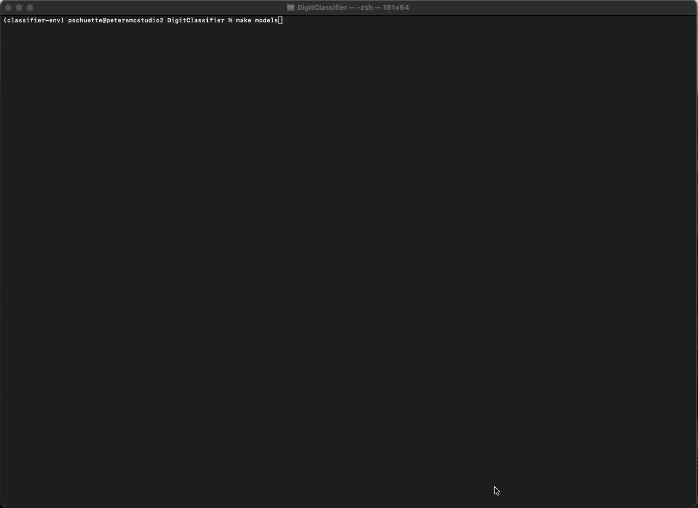
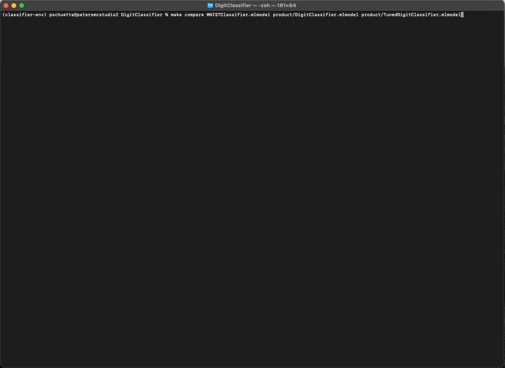
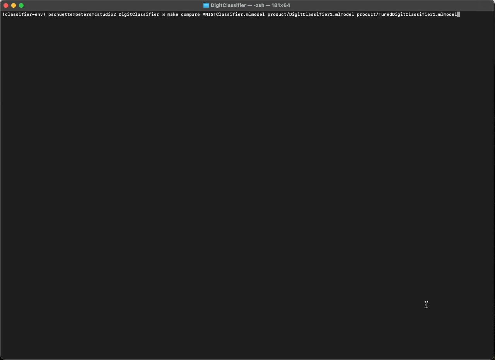

# DigitClassifier
Use font files to augment the MNIST Dataset to train a classifier tuned for printed fonts. This is meant to improve the accuracy of the [SudokuSolver](https://github.com/pschuette22/SudokuSolver) decoding task.


## Install Fonts
### Google Fonts
Download a variety of fonts (the more the better!) from [Google Fonts](https://fonts.google.com/) or from the [Google Fonts Github Project](https://github.com/google/fonts) and add them to the `fonts/` folder.

### FNT
Install fonts using [fnt](https://github.com/alexmyczko/fnt) command line tool.

Downloading all (~4200) font files takes ~1.4G of disk space.
```
fnt update
for a in $(fnt search |grep ^google- |sed s,google-,,); do fnt install $a; done
```

## Create environment
Download and install [miniconda](https://docs.anaconda.com/miniconda/) then activate the environment and install requirements.

```
conda create -n classifier-env python=3.11 pip
conda activate classifier-env
pip install -r requirements.txt
```

## Prepare the Dataset
The first step is to prepare the dataset from downloaded donts. The `make font-dataset` command invokes the `digitclassifier/dataset/builder.py` script and passes in the `fonts/` directory.

Font files containing a valid glyph and excluding those matching patterns in `dataset/ignored.txt` will be added to the output dataset.

```
make font-dataset
```


This creates structured output in the dataset directory:
```
dataset/
  fonts/
    test/
      0/
        FontName.png
        ...
      9/
        FontName.png
    train/
      ...
    validate/
      ...
```
If all Google and fnt fonts are used, this will produce 10 images of digits for approximately 8200 unique fonts.

## Train the Models
Once the dataset is created, train the models using the `make models` command. This command will download the MNIST dataset and train two models. One model will only use the MNIST dataset and another will augment it with the font file digits created in the previous step. Both will print their efficacy against the combined font dataset.

```
make models
```



Produced:
```
product/DigitClassifier.mlmodel
product/TunedDigitClassifer.mlmodel
```

With test accuracy:
| Model                |      MNIST      |  Fonts |  Combined |
|:---------------------|:------:|:------:|:------:|
| DigitClassifier      | 98.73% | 81.39% | 92.02% |
| TunedDigitClassifier | 98.11% | 97.10% | 98.74% |

The two models seems to have similar performance on the MNIST dataset, with the basic model outperforming the tuned model by 0.62%. However, the tuned model drastically outperforms the basic model on font data by 15.71%.

## Comparing the Models
Once trained, the models can be compared against a subset of the images created earlier which were set aside for verification.

The project comes with the MNIST Classifier found in [Apple's Model Garden](https://developer.apple.com/machine-learning/models/).

```
make compare \ 
  MNISTClassifier.mlmodel \
  product/DigitClassifier.mlmodel \
  product/TunedDigitClassifier.mlmodel
```



We get the following results.
| Model                   |  Fonts |
|:------------------------|:------:|
| MNISTClassifier (Apple) | 91.70% |
| DigitClassifier         | 78.10% |
| TunedDigitClassifier    | 97.33% |

These results are about what we expect. Interestingly, the Apple model does pretty well on the font dataset, clocking in at 91.7% accuracy. The tuned classifier reaches 97.33% accuracy, but we'll see if we can improve that in the next section.

## Gardening the fonts

We've created a model that outperforms Apple's MNISTClassifier on printed fonts. _However_ some of the fonts we downloaded may not actually be practical representations of digits. For instance, the xmaslight font represents an '8' like this:


While this is a very fun and cute font, it's not a great representation of the digit 8 for most real-world scenarios, including the Sudoku Solver. It's best to exclude fonts like these because they may cause undesireable behavior from our classifier.

To account for this, we can look for concensus between the three classifier models to find fonts all three consistently classify incorrectly. When such a font is found, we add it to the `dataset/ignore.txt` file so it won't be included in our generated font dataset.

```
make garden-dataset \ 
  MNISTClassifier.mlmodel \
  product/DigitClassifier.mlmodel \
  product/TunedDigitClassifier.mlmodel
```


The gardening script found over 300 fonts in the 8,000+ supplied!

After gardening, we need to regenerated the font dataset, retrain the models, and run the comparison again.

```
make font-dataset
...
make models
...
make compare \ 
  MNISTClassifier.mlmodel \
  product/DigitClassifier1.mlmodel \
  product/TunedDigitClassifier1.mlmodel
```



And voila! We have acheived 98.41% accuracy on printed font digits!
| Model                   |  Fonts |
|:------------------------|:------:|
| MNISTClassifier (Apple) | 95.03% |
| DigitClassifier         | 86.08% |
| TunedDigitClassifier    | 98.41% |