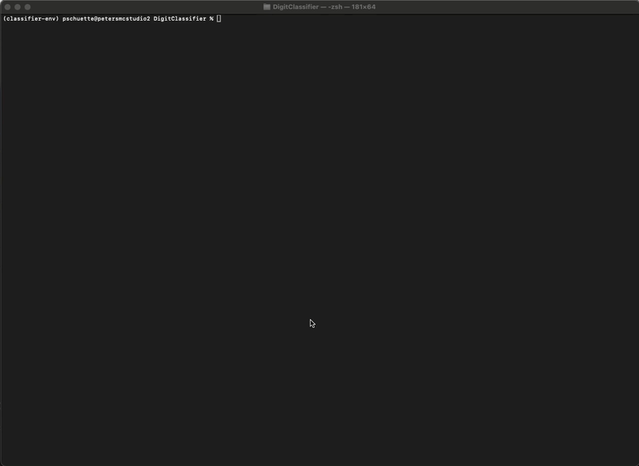

# DigitClassifier
Use font files to augment the MNIST Dataset and to train a classifier better suited for printed fonts. This is meant to improve the accuracy of the [SudokuSolver](https://github.com/pschuette22/SudokuSolver) decoding task.


## Setup
### Install Fonts
Download a variety of fonts (the more the better!) from [Google Fonts](https://fonts.google.com/) or from the [Google Fonts Github Project](https://github.com/google/fonts) and add them to the `fonts/` folder.

Additionally, installing fonts using [fnt](https://github.com/alexmyczko/fnt) will add more training data.

Download ~4200 font files (~1600 fonts), taking up 1.4G of disk space.
```
fnt update
for a in $(fnt search |grep ^google- |sed s,google-,,); do fnt install $a; done
```


### Create environment
Download and install [miniconda](https://docs.anaconda.com/miniconda/).

Create the conda environment, activate, install the requirements, and start the notebook.

```bash
conda create -n classifier-env python=3.11 pip
conda activate classifier-env
pip install -r requirements.txt
```

## Prepare the Dataset
The first step is to prepare the dataset from a set of fonts. Do this by running the build dataset python script over the fonts added to the `fonts` directory

The `digitclassifier/dataset/builder.py` script will convert all fonts found in the `[project}/fonts` directory as well as fnt downloaded fonts into 28x28 grayscale images of each digit. It will ignore fonts with a name partially matching patterns specified in the `dataset/ignored.txt` file.

Font files containing a valid glyph and not matching rules found in the `dataset/ignored.txt` file will be added to the output dataset.

```
make font-dataset
```


This creates structured output in the dataset directory:
```
dataset/
  fonts/
    test/
      0/
        FontName.png
        ...
      9/
        FontName.png
    train/
      ...
    validate/
      ...
```
If all Google and fnt fonts are used, this will produce 10 images of digits using approximately 8200 unique fonts. 


## Train the Models
Once the dataset is created, train the models using the `make models` command. This command will download the MNIST dataset and train two models. One model will only use the MNIST dataset and another will augment it with the font file digits created in the previous step. Both will print their efficacy against the combined font dataset.


```
make models
```

TODO: Training gif

## Comparing the Models
Once trained, the models can be compared against a set of images generated from font and set aside for comparision.

The project comes with the MNIST Classifier found in [Apple's Model Garden](https://developer.apple.com/machine-learning/models/).

```
make compare \ 
  MNISTClassifier.mlmodel \
  product/DigitClassifier.mlmodel \
  product/TunedDigitClassifier.mlmodel
```

TODO: Comparision output media

## Gardening the fonts

Great! We've created a model that outperforms Apple's stock MNISTClassifier on printed fonts. _However_ some of the fonts we downloaded may not actually be practical representations of digits. For instance, the xmaslight font:


To account for this, we can look for concensus between the three classifier models to find fonts all three consistently classify incorrectly.

```
make garden-dataset \ 
  MNISTClassifier.mlmodel \
  product/DigitClassifier.mlmodel \
  product/TunedDigitClassifier.mlmodel
```

// TODO: gardening gif

The gardening script will update the `dataset/ignored.txt` file with fonts that don't seem to be useful representations of printed fonts. 

After gardening, we need to regenerated the font dataset and retrain the models.

```
make font-dataset
...
make models
...
make compare \ 
  MNISTClassifier.mlmodel \
  product/DigitClassifier1.mlmodel \
  product/TunedDigitClassifier1.mlmodel
```

TODO: updated comparision results